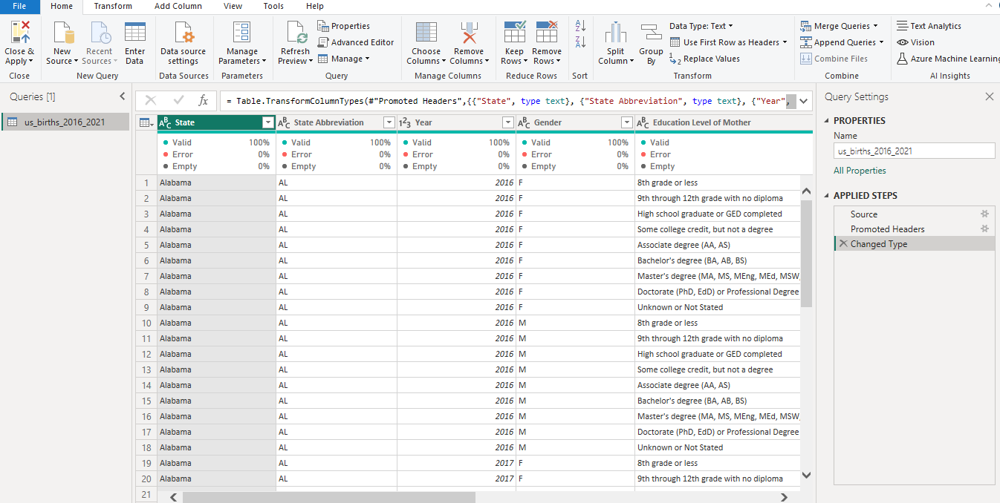
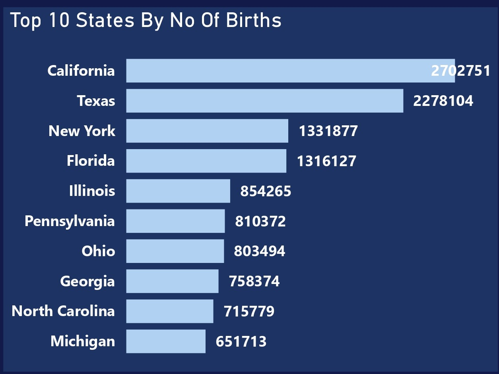
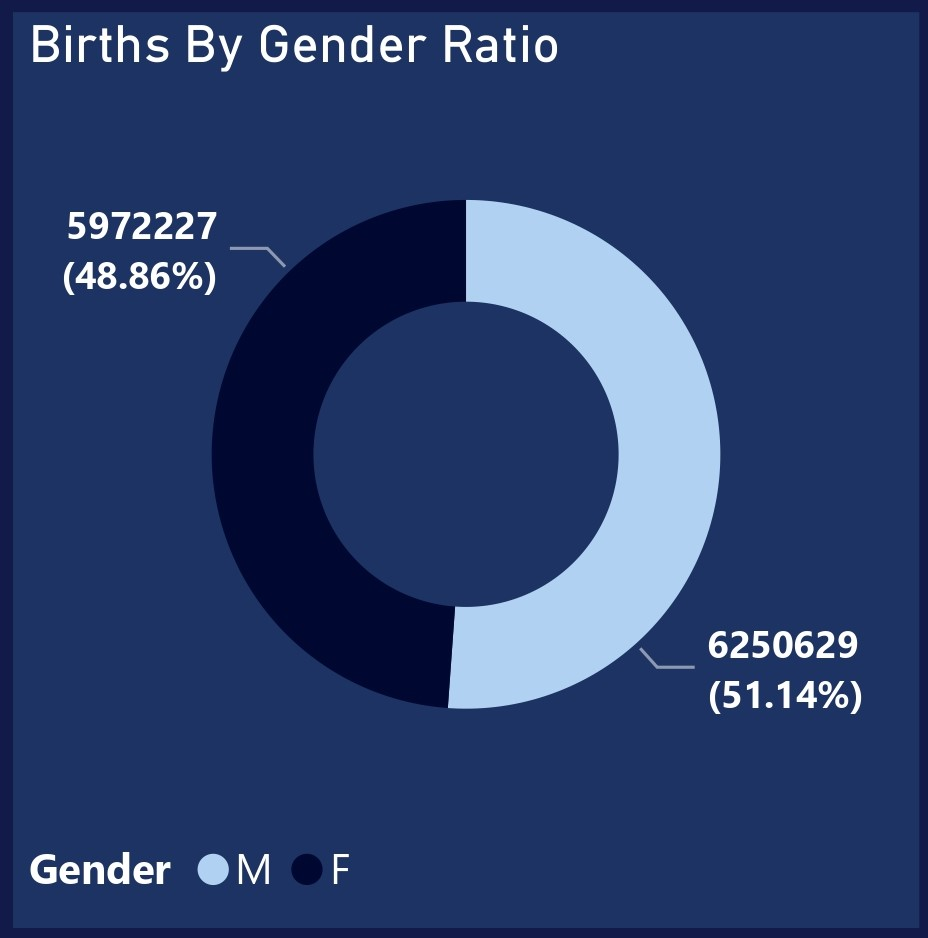
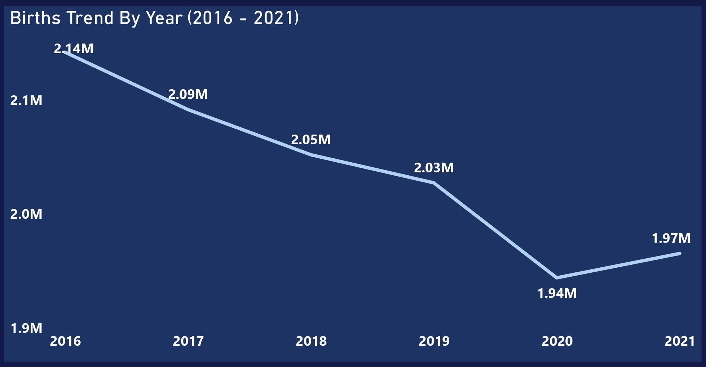
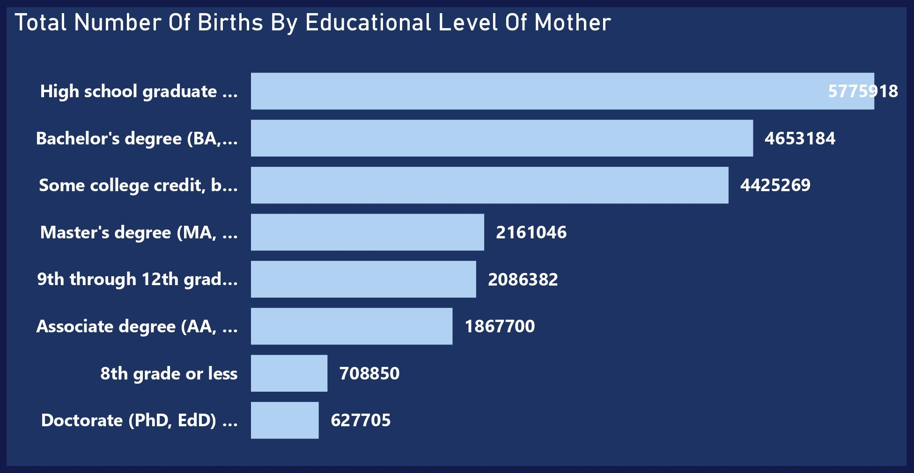
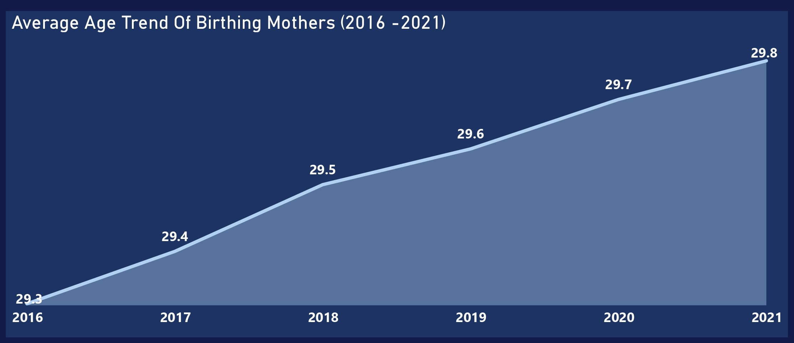
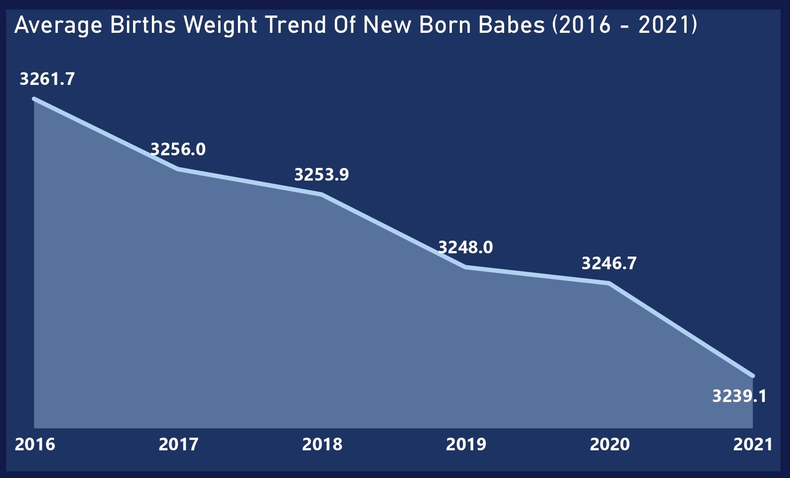
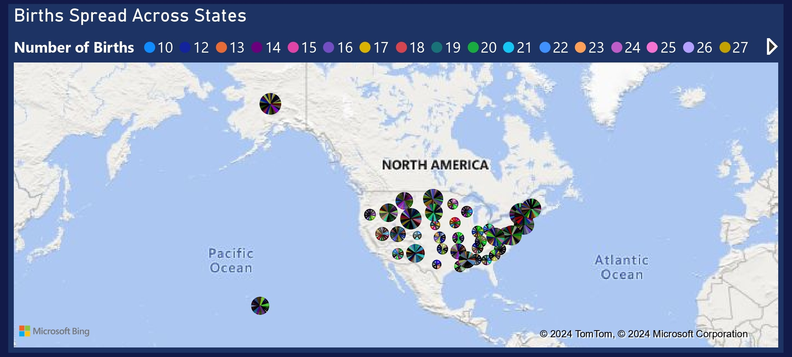

# US Births (2016-2021) Analysis

## Table of Contents
- [Project Overview](#project-overview)
- [Dataset Overview](#dataset-overview)
- [Tools Used](#tools-used)
- [Visualization in Power BI](#visualization-in-power-bi)
- [Project Analysis](#project-analysis)
- [Visuals in Power BI Report](#visuals-in-power-bi-report)
- [Recommendations for Improving the Health and Wellbeing of Mother and Child during Child Birth:](#recommendations-for-improving-the-health-and-wellbeing-of-mother-and-child-during-child-birth)

## Project Overview

### Introduction:
This is an analysis on Births in the US by year, state, and education level of the mother: 2016-2021. This project aims to analyze the trends and patterns of births in the United States from 2016 to 2021, focusing on the demographic variables of the mother's education level, age, geographical location (state), birth rates, and temporal changes over the specified period. By exploring these dimensions, the project seeks to provide insights into potential correlations, disparities, and implications for public health policies and interventions.

### Objectives:
- Examine variations in birth rates across different states over the specified period by looking at the top 10 states by number of births.
- Examine the births ratio by gender
- Analyze the overall trend of births in the US from 2016 to 2021.
- Investigate the relationship between the education level of mothers and birth rates by examining the total number of births by the educational level of mothers.
- Analyze the average age trend of birthing mothers in the US from 2016 to 2021.
- Analyze the average weight trend of new born babies in the US between 2016 and 2021.
- Evaluate the birth spread of new born babies across states with the aid of a geospatial map

### Expected Outcomes:
- Identification of geographic variations in birth rates across the top 10 states by number of births.
- Determination of gender distribution among newborns, highlighting any disparities in birth ratios.
- Understanding of the overall trend of births in the US over the specified period, indicating whether birth rates have increased, decreased, or remained stable.
- Uncovering potential correlations between maternal education level and birth rates through analysis of total births across different educational groups.
- Analysis of the average age of birthing mothers over the specified period, revealing trends and shifts in maternal age.
- Examination of the average weight trend of newborn babies between 2016 and 2021, providing insights into potential health implications.
- Evaluation of birth spread across states using geospatial mapping, identifying regional disparities and informing resource allocation.

### Dataset Overview
This dataset provides birth rates and related data across the 50 states and DC from 2016 to 2021. The data was sourced from the Centers for Disease Control and Prevention (CDC) and includes detailed information such as number of births, gender, birth weight, state, and year of the delivery. A particular emphasis is given to detailed information on the mother's educational level. With this dataset, one can, for example, examine trends and patterns in birth rates across different academic groups and geographic locations.

Each row in the dataset is considered a category defined by the state, birth year, baby's gender, and educational level of the mother. Three quantities are given for each category: number of births, mother's average age, and average baby weight. The CDC is sensitive to potentially disclosing personal information, so any category with less than ten births is suppressed. The data in this dataset was orinally obtained using CDC's WONDER retrieval tool on the [CDC Natality](https://wonder.cdc.gov/natality-current.html) page.

This dataset is made up of a single table with 9 columns and 5,496 rows of data, below is the information abount the columns in this dataset:
- __State:__ This column represents the name of the state where the births occurred. Each entry in this column corresponds to a specific state within the United States.
- __State Abbreviation:__ This column provides the standardized abbreviation for each state. State abbreviations are typically two-letter codes used to uniquely identify each state.
- __Year:__ This column indicates the year in which the births occurred. Each entry in this column corresponds to a specific calendar year within the specified range.
- __Gender:__ This column specifies the gender of the newborns. Entries in this column typically include categories such as "Male" and "Female," indicating the gender of the newborns.
- __Education Level of Mother:__ This column denotes the educational attainment of the mothers. Entries in this column may include categories such as "Less than high school", "High school graduate", "Some college or associate's degree", "Bachelor's degree or higher", etc., representing different levels of education achieved by the mothers.
- __Education Level Code:__ This column provides a numerical code corresponding to the educational level of the mothers. Each educational category mentioned in the "Education Level of Mother" column may have a unique numerical code assigned to it for data processing purposes.
- __Number of Births:__ This column indicates the total number of births that occurred within the specified category. Each entry in this column represents the count of births corresponding to the particular combination of state, year, gender, and education level of the mother.
- __Average Age of Mother (years):__ This column provides the average age of the mothers at the time of giving birth. Entries in this column represent the mean age of mothers within each category, calculated in years.
- __Average Birth Weight (g):__ This column denotes the average birth weight of newborn babies. Entries in this column represent the mean weight of newborns within each category, typically measured in grams.

### Skills Utilized
1. Data Cleaning
2. Data Visualiziation
3. Descriptive Analytics
4. Critical Thinking and Problem Solving
5. Communication and Reporting

### Tools Used
1. Power Query Editor
    - Was used to:
        1. Extract,
        2. Transform,
        4. Load all the datasets for this analysis.
           
2. Power BI (Was used to create reports and dashboard for this analysis)
    - The following Power BI Features were incorporated:
        1. DAX
        2. Quick Measures
        3. Page Navigation
        4. Filters
        5. Tooltips
        6. Buttons

### Data Cleaning, Transformation and Loading using MS Sql Server:
- There was just a some cleaning done here by correcting some text, but no serious data cleaning or transformastion was carried out. The dataset came mostly cleaned, i just made sure that the data types of the fields are of the right types and that fields all reported 100% valid for the column quality.

**Power Query View**

Power Query Screenshot                                                             |                                
:---------------------------------------------------------------------------------:|
)

You can access the complete Power BI project document [here](US%20BIRTHS%20ANALYSIS%20(2016%20-%202021).pbix).

## Data Modelling
No data modelling was required since we needed just a table for the analysis.

## Visualization in Power BI:
#### Report View 1
_Analysis_Dashboard1.jpg)

#### Report View 2
_Analysis_Dashboard2.jpg)

### Project Analysis:
From my analysis, i made the following Key findings below:
- The Total Number of Nnew Births is __22,618,480.__
- Total Number of New Births (Male) __11,568,166.__
- Total Number of New Births (Female) __11,050,314.__
- Total Number of Birth States In This Analysis __51.__
- Total Average Age of Mothers __30.__
- Average Birth Weight __3,251 (g).__

- 
- **The Top 10 States By Number of Births:**
- In this analysis, our first insight is on the top 10 states by number of births, below are insights i derived from the data:
- __California Leads in Total Number of Births:__ California recorded the highest number of births among all states in the dataset, with a total of 2,702,751 births. This indicates a significant proportion of the total births in the United States during the specified period.
- __Texas and New York Follow Closely:__ Texas and New York rank second and third, respectively, in terms of total number of births, with 2,278,104 and 1,331,877 births, respectively. These states also contribute substantially to the overall birth rate in the country.
- __Florida and Illinois in the Top Five:__ Florida and Illinois secure the fourth and fifth positions, respectively, with 1,316,127 and 854,265 births. These states demonstrate substantial populations and significant birth rates.
- __Pennsylvania, Ohio, and Georgia Maintain High Birth Counts:__ Pennsylvania, Ohio, and Georgia occupy the sixth, seventh, and eighth positions, respectively, with 810,372, 803,494, and 758,374 births. These states consistently contribute to the overall birth statistics in the US.
- __North Carolina and Michigan Complete the Top 10:__ North Carolina and Michigan round out the top 10 states in terms of total number of births, with 715,779 and 651,713 births, respectively. While slightly lower in birth counts compared to the top-ranking states, they still make significant contributions to the national birth rate.

- 
- **Births By Gender Ratio:**
- In analyzing the births by gender ratio, i came up with the below findings: 
- __Male Births Outnumber Female Births:__ Among the births recorded in the dataset, there were a total of 6,250,629 male births, constituting approximately 51.14% of the total. This indicates a slight predominance of male births over female births during the specified period.
- __Female Births Account for 48.86%:__ Female births accounted for 5,972,227 births, making up approximately 48.86% of the total. Although slightly lower than male births, female births still represent a substantial proportion of the overall birth count.
- __Insights into Gender Ratio at Birth:__ The slightly higher proportion of male births aligns with global trends in some parts of the world, where male births typically outnumber female births. Factors such as biological differences, genetic factors, and societal influences may contribute to variations in gender ratios at birth.

- 
- **Births Trend By Year (2016-2021):**
- In this analysis, i evaluated the births trend between 2016 - 2021, below are insights i derived from the data:
- __Gradual Decline in Total Births Over Time:__ The data reveals a gradual decline in the total number of births in the United States from 2016 to 2021. In 2016, there were 2,142,254 births, which decreased to 1,965,325 births in 2021.
- __Steady Decline from 2016 to 2020:__ From 2016 to 2020, there is a consistent downward trend in the number of births each year. This steady decline suggests potential demographic or socio-economic factors influencing birth rates during this period. The COVID-19 pandemic likely contributed to the downward trend in childbirth rates observed in 2020. The pandemic may have raised the fears of economic uncertainty, health concerns, disruption of healthcare services, and social distancing measures which impacted on the number of births in 2020.
- __Slight Increase in Births from 2020 to 2021:__ After reaching a low of 1,943,917 births in 2020, there is a slight increase in the number of births to 1,965,325 in 2021. While this increase may indicate a temporary deviation from the downward trend. Several factors may have contributed to the slight increase in childbirth rates observed in 2021 like the easing of pandemic restrictions, pent-up demand for procreation after the easing of the pandemic restrictions, improved access to healthcare services, social support networks, and other factors may have influenced this slight births increase.

- 
- **Number of Births By Educational Level of Mother:**
- This is an analysis of the number of births by educational level of mother, below are insights i derived from the data:
- __High Birth Rates Among Mothers with High School Education or Equivalent:__ Mothers who completed high school or obtained a General Educational Development (GED) certificate accounted for the highest number of births, with a total of 5,775,918 births. This suggests that a significant proportion of births are to mothers with a high school education level, highlighting the importance of this demographic group in childbirth statistics.
- __Substantial Births Among Mothers with Bachelor's Degrees and Some College Credit:__ Mothers with a Bachelor's degree (BA, AB, BS) contributed significantly to the total number of births, with 4,653,184 births. Additionally, mothers with some college credit but no degree accounted for 4,425,269 births. These findings indicate that women with higher levels of educational attainment, including those with bachelor's degrees and some college credit, also contribute substantially to childbirth statistics.
- __Moderate Birth Rates Among Mothers with Master's Degrees and Associate Degrees:__ Mothers with Master's degrees (MA, MS, MEng, MEd, MSW, MBA) had a moderate number of births, totaling 2,161,046 births. Similarly, mothers with Associate degrees (AA, AS) accounted for 1,867,700 births. While these educational groups have fewer births compared to those with high school or bachelor's degrees, they still make a significant contribution to the total number of births.
- __Lower Birth Rates Among Mothers with Lower Educational Attainment:__ Mothers with lower educational attainment, such as those with 9th through 12th grade education with no diploma or 8th grade or less education, had comparatively lower numbers of births. Mothers in these educational categories accounted for 2,086,382 and 708,850 births, respectively. These findings suggest that educational attainment may be inversely correlated with birth rates, with higher levels of education generally associated with lower birth rates.
- __Impact of Educational Attainment on Family Planning and Childbirth:__ The distribution of births across different educational levels highlights the complex relationship between education and family planning decisions. Factors such as socioeconomic status, access to resources, cultural norms, and personal aspirations may influence the timing and number of children individuals choose to have at different educational levels.

- 
- **Average Age Trend of Birthing Mothers (2016-2021):**
- This analysis focuses on the average age of birthing mothers over the specified period, revealing trends and shifts in maternal age.of the number of births of mother, below are insights derived from the data:
- __Gradual Increase in Average Maternal Age Over Time:__ The data shows a consistent upward trend in the average age of birthing mothers from 2016 to 2021. In 2016, the average maternal age was 29.3 years, which increased steadily to 29.77 years in 2021.
- __Significance of Incremental Changes:__ While the changes in average maternal age may seem small, they reflect meaningful shifts in family planning and demographic trends over time.
Even slight increases in average maternal age can have important implications for maternal and child health outcomes, as well as for social and economic factors.
- __Factors Driving Increase in Maternal Age:__ Several factors may contribute to the trend of increasing maternal age, including delayed childbearing for career or educational pursuits, financial stability, and personal choice. Cultural shifts, changes in societal norms, and improvements in access to contraception and fertility treatments may also play a role in the decision to postpone childbirth.
- __Health and Fertility Considerations:__ Advanced maternal age (typically defined as age 35 and older) may present certain health risks for both mothers and babies, including an increased likelihood of pregnancy complications and chromosomal abnormalities. Monitoring trends in average maternal age is important for healthcare providers and policymakers to anticipate and address the unique needs and challenges associated with pregnancies at older ages.

- 
- **Average Births Weight Trend of New Born Babies (2016-2021):**
- In this analysis, the focus is on the average births weights trend of new born babies over the specified period, , below are insights derived from the data:
- __Gradual Decline in Average Birth Weight Over Time:__ The data shows a consistent downward trend in the average birth weight of newborn babies from 2016 to 2021. In 2016, the average birth weight was 3,261.68 grams, which decreased to 3,239.15 grams in 2021.
- __Significance of the Decline:__ While the changes in average birth weight may seem small, even slight decreases can have implications for infant health and development. Monitoring trends in average birth weight is essential for identifying potential shifts in maternal and infant health outcomes and informing public health interventions.
- __Possible Factors Contributing to Decrease in Birth Weight:__ Several factors may contribute to the observed trend of decreasing birth weight over time. These factors may include changes in maternal health behaviors, such as smoking or substance use during pregnancy, as well as shifts in maternal demographics, such as maternal age or pre-existing health conditions.
- __Health Implications for Newborns:__ Lower birth weights are associated with an increased risk of various health complications for newborns, including respiratory distress syndrome, low blood sugar, and developmental delays. Monitoring trends in average birth weight can help healthcare providers identify infants at risk for health complications and implement appropriate interventions to support their health and development.

- 
- **Geospatial Map of Births Across States in the US (2016-2021):**
- __Visual Representation of Birth Distribution:__ A geospatial map provides a visual representation of the distribution of births across different states in the United States. Each state is represented geographically, allowing for easy identification of regions with higher or lower birth rates.
- __Identification of Regional Disparities:__ The geospatial map enables the identification of regional disparities in birth rates, with some states experiencing higher birth rates than others. Variations in birth rates may be influenced by factors such as population density, socioeconomic status, access to healthcare services, and cultural norms.
- __Insights into Demographic Trends:__ Analyzing the distribution of births across states can provide insights into demographic trends and patterns. For example, states with higher birth rates may have younger populations or higher fertility rates, while states with lower birth rates may have aging populations or lower fertility rates.
- __Informing Public Health Interventions:__ The geospatial map can inform public health interventions aimed at improving maternal and child health outcomes. Identifying regions with higher birth rates may prompt targeted efforts to improve access to prenatal care, maternal health services, and infant healthcare resources.

## Visuals in Power BI Report:
You can view and interact with this dashboard report [here](https://app.powerbi.com/view?r=eyJrIjoiYzM1NzJjZWEtZTc1Zi00NjNhLTk1NzMtMGEwODQ1ZjRlYzdhIiwidCI6IjdlYzI5NjU5LTNjZjItNGYzZi1hYmIzLWE3MjJlZGY3ZmYyZCJ9).

## Recommendations for Improving the Health and Wellbeing of Mother and Child during Child Birth:
- __Access to Prenatal Care:__ The Health Institutions should ensure universal access to quality prenatal care services, including regular check-ups, screenings, and education on healthy behaviors during pregnancy.
- __Education and Support:__ THey should provide comprehensive prenatal education to expectant mothers and their families, covering topics such as nutrition, prenatal vitamins, exercise, and childbirth preparation. They could also offer counseling and support services for mental health and emotional well-being during pregnancy and postpartum.
- __Nutritional Support:__ They can promote access to nutritious foods and prenatal supplements to support maternal and fetal health. They could offer nutritional counseling and support for pregnant women, particularly those at risk of malnutrition or nutrient deficiencies.
- __Continuity of Care:__ The health institutions can ensure continuity of care throughout pregnancy, childbirth, and the postpartum period by facilitating communication and coordination among healthcare providers.
- __Access to Skilled Birth Attendants:__ It would be impactful if they could ncrease access to skilled birth attendants, including midwives, obstetricians, and other qualified healthcare professionals, to provide safe and supportive childbirth experiences.
- __Facility-Based Childbirth Services:__ They can promote facility-based childbirth services with adequate infrastructure, equipment, and staffing to ensure safe and hygienic delivery environments.
- __Postpartum Support and Follow-up:__ They can implement or improve on postpartum care protocols to monitor maternal and newborn health after childbirth, including assessments for complications, breastfeeding support, and mental health screening. They can also offer lactation counseling, and referrals to community resources to address the physical, emotional, and social needs of new mothers and their families.

## Thank You For Following Through!
